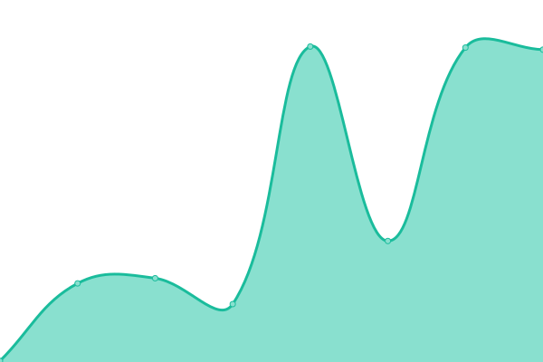
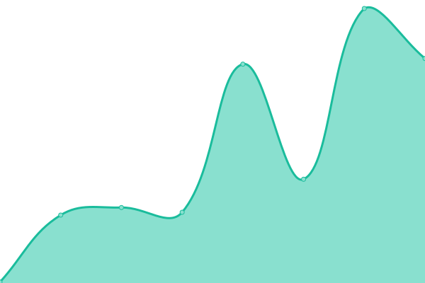
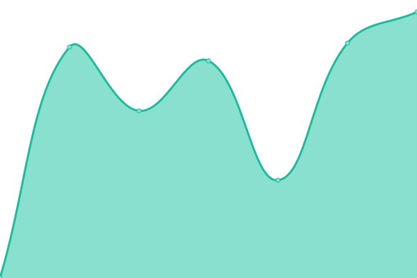

# [📈 Live Status](https://demo.upptime.js.org): <!--live status--> **🟩 All systems operational**

This repository contains the open-source uptime monitor and status page for [iofane](https://demo.upptime.js.org), powered by [Upptime](https://github.com/upptime/upptime).

With [Upptime](https://upptime.js.org), you can get your own unlimited and free uptime monitor and status page, powered entirely by a GitHub repository. We use [Issues](https://github.com/iofane/gitup/issues) as incident reports, [Actions](https://github.com/iofane/gitup/actions) as uptime monitors, and [Pages](https://demo.upptime.js.org) for the status page.

<!--start: status pages-->
<!-- This summary is generated by Upptime (https://github.com/upptime/upptime) -->
<!-- Do not edit this manually, your changes will be overwritten -->
<!-- prettier-ignore -->
| URL | Status | History | Response Time | Uptime |
| --- | ------ | ------- | ------------- | ------ |
|  [Crowdstrike US-1](https://ts01-b.cloudsink.net) | 🟩 Up | [crowdstrike-us-1.yml](https://github.com/iofane/gitup/commits/HEAD/history/crowdstrike-us-1.yml) | 

 297ms
     
 | 

<a href="https://iofane.github.io/gitup/history/crowdstrike-us-1">100.00%</a>
    

|  [Crowdstrike Login](https://falcon.crowdstrike.com/login/) | 🟩 Up | [crowdstrike-login.yml](https://github.com/iofane/gitup/commits/HEAD/history/crowdstrike-login.yml) | 

 258ms
     
 | 

<a href="https://iofane.github.io/gitup/history/crowdstrike-login">100.00%</a>
    

|  [Gold Coast](https://www.goldcoast.qld.gov.au/Home) | 🟩 Up | [gold-coast.yml](https://github.com/iofane/gitup/commits/HEAD/history/gold-coast.yml) | 

 980ms
     
 | 

<a href="https://iofane.github.io/gitup/history/gold-coast">100.00%</a>
    

|  [Netskope SV5 - 1](8.36.116.70) | 🟩 Up | [netskope-sv-5-1.yml](https://github.com/iofane/gitup/commits/HEAD/history/netskope-sv-5-1.yml) | 

 55ms
     
 | 

<a href="https://iofane.github.io/gitup/history/netskope-sv-5-1">94.48%</a>
    

|  [Netskope SV5 - 2](https://cogc.goskope.com) | 🟩 Up | [netskope-sv-5-2.yml](https://github.com/iofane/gitup/commits/HEAD/history/netskope-sv-5-2.yml) | 

 1020ms
     
 | 

<a href="https://iofane.github.io/gitup/history/netskope-sv-5-2">94.49%</a>
    

<!--end: status pages-->

[**Visit our status website →**](https://demo.upptime.js.org)

## 📄 License

- Powered by: [Upptime](https://github.com/upptime/upptime)
- Code: [MIT](./LICENSE) © [Anand Chowdhary](https://anandchowdhary.com), supported by [Pabio](https://pabio.com)
- Data in the `./history` directory: [Open Database License](https://opendatacommons.org/licenses/odbl/1-0/)
